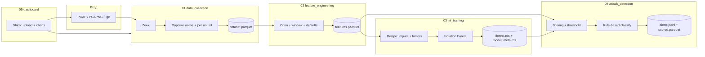
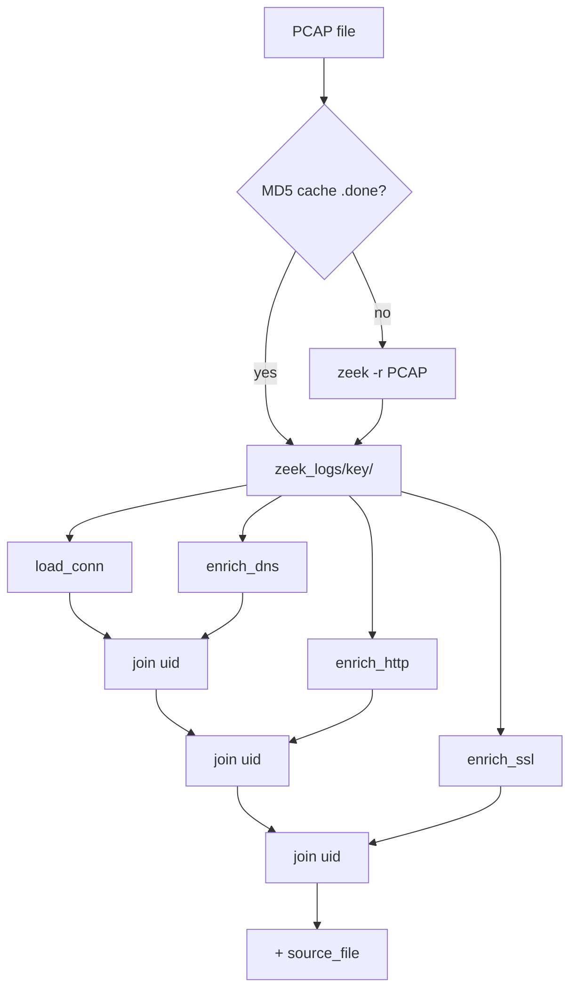
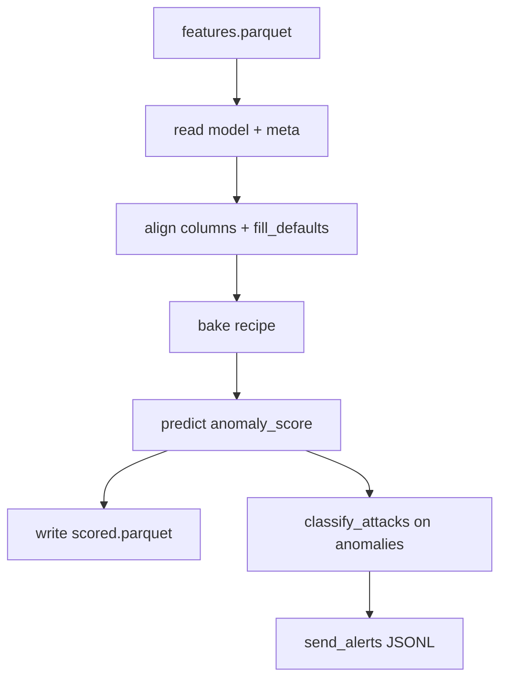

# IoT IDS (IDS_AI-ISTD)

Пакет R реализует **пакетный конвейер обнаружения вторжений (IDS)** для сетевого трафика IoT: от PCAP-захватов до ML-скоринга, rule-based классификации атак и веб-дашборда.

Точка входа из корня репозитория: [`run_pipeline.R`](../run_pipeline.R).

---

## Содержание

1. [Общая архитектура](#общая-архитектура)
2. [Логика работы проекта](#логика-работы-проекта)
3. [Запуск и окружение](#запуск-и-окружение)
4. [Модули R](#модули-r)
   - [`00_config.R`](#00_configr--конфигурация-конвейера)
   - [`utils.R`](#utilsr--общие-утилиты)
   - [`01_data_collection.R`](#01_data_collectionr--сбор-данных-и-etl)
   - [`02_feature_engineering.R`](#02_feature_engineeringr--инженерия-признаков)
   - [`03_ml_training.R`](#03_ml_trainingr--обучение-модели)
   - [`04_attack_detection.R`](#04_attack_detectionr--детектирование-атак)
   - [`05_dashboard.R`](#05_dashboardr--веб-дашборд-shiny)
   - [`pipeline_runner.R`](#pipeline_runnerr--оркестратор-стадий)
   - [`pcap_upload.R`](#pcap_uploadr--загрузка-pcap)

---

## Общая архитектура

Система построена как **линейный batch-pipeline** из четырёх стадий обработки данных и опционального интерактивного слоя (Shiny). Внешний анализатор трафика — **Zeek**; машинное обучение — **Isolation Forest** (`isotree`); препроцессинг признаков — **tidymodels** (`recipes`, `rsample`).

### Схема конвейера



### Поток данных на диске

Все артефакты привязаны к `PROJECT_ROOT` (корень репозитория). Каталоги создаются автоматически при загрузке `00_config.R`.

```
PROJECT_ROOT/
├── data/
│   ├── pcap/              # эталонные/демо PCAP (стадия data по умолчанию)
│   ├── pcap/uploaded/     # PCAP из дашборда
│   ├── zeek_logs/<md5>/   # кеш логов Zeek по хешу содержимого PCAP
│   └── processed/
│       ├── dataset.parquet
│       ├── features.parquet
│       └── scored.parquet
├── models/
│   ├── iforest.rds
│   └── model_meta.rds     # threshold, recipe, метаданные
└── alerts/
    └── alerts.jsonl       # одна JSON-строка на алерт
```

### Режимы запуска

1. **CLI / CI / Docker** — `Rscript run_pipeline.R` (или выборочные стадии). PCAP по умолчанию из `data/pcap/`.
2. **Интерактивный** — Shiny (`05_dashboard.R`): загрузка в `data/pcap/uploaded/`, полный конвейер через `run_ids_pipeline(pcap_dir = PATHS$pcap_upload_dir)`.

### Зависимости между модулями

```
00_config.R  ←── все модули
utils.R      ←── 01, 02, 03, 04, 05, pipeline_runner (косвенно)
02_feature_engineering.R ←── 03, 04  (NUM_FEATURES, FEATURE_DEFAULTS, fill_defaults)
03_ml_training.R         ←── 04      (косвенно через общие пути)
pipeline_runner.R        ←── 05
pcap_upload.R            ←── 05
```

Каждый нумерованный скрипт (`01`–`04`) при `source()` подтягивает `00_config.R` и `utils.R` в локальной обёртке `local({ ... })`, чтобы корректно работать из любой рабочей директории.

### Сводная таблица файлов

| Файл | Назначение |
|------|------------|
| `00_config.R` | Пути, параметры модели и детектора, зависимости |
| `01_data_collection.R` | Zeek + ETL → `dataset.parquet` |
| `02_feature_engineering.R` | Признаки → `features.parquet` |
| `03_ml_training.R` | Isolation Forest + tidymodels recipe |
| `04_attack_detection.R` | Скоринг, правила, алерты |
| `05_dashboard.R` | Shiny UI |
| `pipeline_runner.R` | Оркестрация стадий |
| `pcap_upload.R` | Загрузка PCAP из UI |
| `utils.R` | Логирование, парсер Zeek, хелперы |

---

## Логика работы проекта

1. **Сбор (ETL):** для каждого PCAP Zeek пишет `conn.log`, `dns.log`, `http.log`, `ssl.log`. Строки соединений обогащаются DNS/HTTP/SSL-признаками по полю `uid`, нормализуются имена IP/портов → единая таблица сессий.
2. **Признаки:** на уровне соединения считаются объёмы, скорости, энтропии; в 5-минутных «корзинах» по `src_ip` — агрегаты активности (сканирование, DDoS-подобные паттерны).
3. **Обучение:** 80/20 split, recipe заполняет пропуски и кодирует категории; Isolation Forest обучается на трафике без меток; порог аномалии — квантиль `threshold_quant` на валидации.
4. **Детект:** все сессии скорятся; `is_anomaly = score > threshold`; для аномалий — гибридный классификатор: строгие правила + адаптивные для малых PCAP + протокольные эвристики; результат в JSONL.
5. **Дашборд:** визуализация `scored.parquet` и алертов, запуск конвейера из UI.

---

## Запуск и окружение

### Команды

```bash
# Полный конвейер (PCAP из data/pcap/)
Rscript run_pipeline.R

# Свой каталог PCAP
Rscript run_pipeline.R --pcap-dir data/pcap/uploaded

# Только отдельные стадии
Rscript run_pipeline.R features train detect

# Дашборд
Rscript -e 'shiny::runApp("R/05_dashboard.R", port=4321, host="0.0.0.0")'
```

### Переменные окружения

| Переменная | Назначение |
|------------|------------|
| `IDS_V2_ROOT` | Корень проекта (выставляет `run_pipeline.R`) |
| `ZEEK_BIN` | Путь к бинарнику Zeek (по умолчанию `zeek`) |
| `CI=true` | Запрет автоустановки пакетов в `ensure_packages()` |

### Зависимости R

Список пакетов — в [`DESCRIPTION`](../DESCRIPTION). Установка: `Rscript install_dependencies.R`.

**Обязательные** (`REQUIRED_PKGS`): `data.table`, `arrow`, `digest`, `processx`, `jsonlite`, `stringi`, `isotree`, `recipes`, `rsample`.

**Опциональные** для дашборда: `shiny`, `DT`, `plotly`, `bslib`.

### Тестирование

`Rscript tests/test_basic.R` — утилиты, конфиг, классификатор атак на синтетических строках (без Zeek).

---

## Модули R

---

## `00_config.R` — конфигурация конвейера

Единый модуль инициализации: определение корня проекта, путей к данным и моделям, гиперпараметров ML и детектора, а также загрузка R-пакетов.

### Роль в архитектуре

Загружается **первым** во всех стадиях pipeline. Любой скрипт в `R/`, вызванный через `source(..., chdir = TRUE)` или оркестратор `run_pipeline.R`, получает согласованные глобальные объекты `PROJECT_ROOT`, `PATHS`, `MODEL_PARAMS`, `DETECT_PARAMS`.

### Определение корня проекта

#### `.find_this_dir()`

Определяет каталог `R/` в порядке приоритета:

1. **`IDS_V2_ROOT`** — переменная окружения (устанавливается в `run_pipeline.R`); возвращает `IDS_V2_ROOT/R`.
2. **`Rscript --file=`** — директория запускаемого скрипта.
3. **`source()`** — `sys.frame(1)$ofile`.
4. **RStudio** — `rstudioapi::getSourceEditorContext()$path`.
5. **Fallback** — `getwd()`.

#### Производные переменные

| Переменная | Значение | Назначение |
|------------|----------|------------|
| `.this_dir` | Результат `.find_this_dir()` | Каталог `R/` |
| `PROJECT_ROOT` | `normalizePath(.this_dir/..)` | Корень репозитория IDS_AI-ISTD |

### `PATHS` — файловая схема

| Ключ | Путь | Назначение |
|------|------|------------|
| `pcap_dir` | `data/pcap` | PCAP для batch ETL по умолчанию |
| `pcap_upload_dir` | `data/pcap/uploaded` | PCAP, загруженные через Shiny |
| `zeek_logs_dir` | `data/zeek_logs` | Кеш выходов Zeek (подкаталоги по MD5 PCAP) |
| `processed_dir` | `data/processed` | Parquet-артефакты |
| `models_dir` | `models` | Обученные модели |
| `alerts_dir` | `alerts` | Файлы алертов |
| `dataset` | `.../dataset.parquet` | Сырые объединённые сессии после ETL |
| `features` | `.../features.parquet` | Таблица с ML-признаками |
| `scored` | `.../scored.parquet` | Сессии с `anomaly_score` и `is_anomaly` |
| `model_file` | `models/iforest.rds` | Объект `isolation.forest` |
| `meta_file` | `models/model_meta.rds` | Метаданные: порог, recipe, список колонок |
| `alerts_file` | `alerts/alerts.jsonl` | JSON Lines с алертами |
| `block_script` | `scripts/block_ip.sh` | Внешний скрипт блокировки IP (зарезервировано) |

При загрузке конфига для всех ключей, оканчивающихся на `_dir`, вызывается `dir.create(..., recursive = TRUE)`.

### `ZEEK_BIN`

Путь к исполняемому файлу Zeek. По умолчанию `"zeek"`; переопределяется через `Sys.getenv("ZEEK_BIN", "zeek")`.

### `MODEL_PARAMS` — обучение Isolation Forest

| Параметр | Значение по умолчанию | Смысл |
|----------|----------------------|--------|
| `ntrees` | 200 | Число деревьев в лесу |
| `sample_size` | 256 | Размер подвыборки на дерево |
| `max_depth` | 100 | Максимальная глубина |
| `ndim` | 1 | Размерность подпространства (1 = классический iForest) |
| `contamination` | 0.01 | Ожидаемая доля аномалий (справочно) |
| `threshold_quant` | 0.99 | Квантиль score на validation → порог «аномалия» |
| `seed` | 42 | Воспроизводимость |
| `nthreads` | `detectCores() - 1` | Потоки `isotree` (минимум 1) |

### `DETECT_PARAMS` — детектирование и правила

| Параметр | Значение | Смысл |
|----------|----------|--------|
| `window_seconds` | 300 | Окно агрегации (5 мин) в feature engineering |
| `alert_min_score` | 0.55 | Зарезервирован (основной отсев — `meta$threshold`) |
| `enable_blocking` | `FALSE` | Вызов `block_ip.sh` |
| `dedup_seconds` | 60 | Дедупликация алертов (зарезервировано) |
| `rules` | см. ниже | Пороги rule-based классификатора |

#### `DETECT_PARAMS$rules`

| Ключ | Значение | Назначение |
|------|----------|------------|
| `adaptive_frac` | 0.75 | Доля от максимума метрики в батче (малые PCAP) |
| `query_entropy` | 3.0 | Подозрительная энтропия DNS |
| `query_length` | 40 | Длина DNS-запроса |
| `uri_length` | 150 | Длина HTTP URI |
| `ssl_entropy` | 3.0 | Энтропия SNI |
| `volume_pct` | 150 | Рост объёма между окнами, % |
| `fallback_type` | `"ml_anomaly"` | Тип, если правила не сработали |

### Загрузка пакетов

#### `ensure_packages(pkgs)`

- Проверяет `requireNamespace`.
- В **CI** (`CI=true`) при отсутствии — `stop()`.
- Локально — `install.packages()` + `library()`.

#### `REQUIRED_PKGS` / `OPTIONAL_PKGS`

Обязательные — в `DESCRIPTION` Imports. Опциональные (`shiny`, `DT`, `plotly`, `bslib`) — в `05_dashboard.R`.

### Пример

```r
Sys.setenv(IDS_V2_ROOT = "/path/to/IDS_AI-ISTD")
source("R/00_config.R", chdir = TRUE)
ensure_packages(REQUIRED_PKGS)
```

---

## `utils.R` — общие утилиты

Вспомогательные функции для логирования, типов, парсинга Zeek. Обычно подключается сразу после конфига.

### Логирование

| Функция | Описание |
|---------|----------|
| `log_msg(level, fmt, ...)` | Базовый лог: `[timestamp] LEVEL message` |
| `log_info`, `log_warn`, `log_error` | Уровни INFO, WARN, ERROR |

### Операторы и числовые хелперы

| Функция | Описание |
|---------|----------|
| `` `%||%` `` | Null-coalescing: NULL/пусто → значение по умолчанию |
| `safe_num(x)` | numeric; NA/Inf → 0 |
| `safe_max(x, default = 0)` | max по конечным значениям; всегда `double` |

### Энтропия

| Функция | Описание |
|---------|----------|
| `shannon_entropy(s)` | Энтропия Шеннона одной строки (биты) |
| `shannon_entropy_v(strs)` | Векторизованная версия для DNS/SSL |

### Парсинг Zeek

#### `read_zeek_tsv(path)`

Читает ASCII TSV-лог Zeek: `#fields` → имена колонок, тело через `fread`, `na.strings = c("-", "(empty)", "(unset)")`. Возвращает `data.table` или `NULL`.

#### `safe_col(dt, name, default, n)`

Колонка или вектор `default` нужной длины.

### Прочее

- `load_rds_or_null(path)` — `readRDS` или `NULL`
- `source_sibling(name)` — `source` соседнего файла из `R/`

### Использование в проекте

| Функция | Модули |
|---------|--------|
| `log_*` | 01–05, pipeline_runner |
| `safe_num`, `safe_max` | 01, 02, 04 |
| `shannon_entropy_v` | 01 |
| `read_zeek_tsv`, `safe_col` | 01 |
| `%||%` | 01, 02, 04, 05, pcap_upload |

---

## `01_data_collection.R` — сбор данных и ETL

Преобразует PCAP в датасет сессий **connection (conn)** с обогащением из DNS, HTTP и SSL.

| | |
|---|---|
| **Вход** | `*.pcap`, `*.pcapng`, `*.pcap.gz` в `PATHS$pcap_dir` |
| **Выход** | `PATHS$dataset` → `data/processed/dataset.parquet` |
| **Точка входа** | `run_etl(pcap_dir, out_path)` |

### Кеширование Zeek — `run_zeek(pcap_path)`

1. `cache_key` = MD5 **содержимого** PCAP.
2. Каталог: `PATHS$zeek_logs_dir/<cache_key>/`, маркер `.done`.
3. `processx::run(ZEEK_BIN, c("-r", pcap, "LogAscii::use_json=F"), wd = out_dir, timeout = 600)`.

### `load_conn(zeek_dir)`

- `id.orig_h` → `src_ip`, `id.orig_p` → `src_port`, `id.resp_h` → `dst_ip`, `id.resp_p` → `dst_port`
- Числовые/строковые поля через `safe_num` и `as.character`

### Обогащение по `uid`

| Функция | Лог | Признаки (max по uid) |
|---------|-----|------------------------|
| `enrich_dns` | dns.log | `query_length`, `query_entropy`, `num_labels` |
| `enrich_http` | http.log | `uri_length`, `ua_length`, `http_status_code`, `http_method` |
| `enrich_ssl` | ssl.log | `ssl_sni_length`, `ssl_sni_entropy` |

`join_uid(conn, aux)` — left join по `uid`.

### `process_pcap(pcap_path)`

`run_zeek` → `load_conn` → join DNS/HTTP/SSL → `source_file`.

### `run_etl(pcap_dir, out_path)`

Список PCAP → `lapply(process_pcap)` → `rbindlist` → `write_parquet`.

### Диаграмма одного PCAP



### Поля dataset

| Группа | Поля |
|--------|------|
| Идентификация | `uid`, `ts`, `src_ip`, `src_port`, `dst_ip`, `dst_port`, `proto`, `service`, `conn_state`, `history` |
| Объёмы | `duration`, `orig_bytes`, `resp_bytes`, `orig_pkts`, `resp_pkts`, … |
| DNS / HTTP / SSL | см. enrich_* |
| Мета | `source_file` |

---

## `02_feature_engineering.R` — инженерия признаков

| | |
|---|---|
| **Вход** | `PATHS$dataset` |
| **Выход** | `PATHS$features` |
| **Точка входа** | `build_features(in_path, out_path)` |

### Константы

- **`FEATURE_DEFAULTS`** — дефолты для числовых ML-колонок (обычно 0).
- **`NUM_FEATURES`** — `names(FEATURE_DEFAULTS)` — только они идут в ML.
- **`CAT_FEATURES`** — `proto`, `service`, `conn_state` → пропуски `"unknown"`.

### Числовые признаки

| Признак | Источник | Смысл |
|---------|----------|--------|
| `duration`, `orig_bytes`, `resp_bytes`, … | conn | Базовые метрики |
| `total_bytes` | `orig + resp` | Суммарный объём |
| `bytes_per_sec` | `total_bytes / duration` | Интенсивность |
| `pkt_ratio` | `orig_pkts / resp_pkts` | Асимметрия |
| `history_length` | `nchar(history)` | Флаги Zeek |
| `uri_length`, `ua_length`, `http_status_code` | HTTP | Веб-аномалии |
| `query_length`, `query_entropy`, `num_labels` | DNS | DGA, длинные имена |
| `ssl_sni_length`, `ssl_sni_entropy` | SSL | SNI |
| `conn_count_5min` | окно | Соединений с `src_ip` за 5 мин |
| `dest_port_distinct` | окно | Уникальные порты (сканирование) |
| `unique_dst_ip` | окно | Уникальные IP назначения |
| `bytes_5min` | окно | Сумма байт в окне |
| `data_volume_change` | окно | % к предыдущему bucket |

### Функции

- **`add_conn_features(dt)`** — производные на уровне сессии.
- **`add_window_features(dt, win = 300)`** — агрегаты по `(src_ip, bucket)`, `bucket = floor(ts/win)`.
- **`fill_defaults(dt)`** — гарантия всех колонок; используется в detect.
- **`build_features()`** — полный pipeline записи parquet.

---

## `03_ml_training.R` — обучение модели

| | |
|---|---|
| **Вход** | `PATHS$features` |
| **Выход** | `iforest.rds`, `model_meta.rds` |
| **Точка входа** | `train_iforest(...)` |

### Алгоритм `train_iforest`

1. Отбор `NUM_FEATURES` + `CAT_FEATURES`.
2. `initial_split` 80/20 (`rsample`).
3. **Recipe:** `step_impute_median`, `step_string2factor`, `step_novel`.
4. `prep` + `bake` на train/valid.
5. `isotree::isolation.forest(...)` с `MODEL_PARAMS`.
6. Порог: `quantile(scores_val, threshold_quant)` — выше score = аномальнее.

### `model_meta.rds`

| Поле | Описание |
|------|----------|
| `threshold` | Порог для `is_anomaly` |
| `recipe` | Объект `prep` для `bake()` на detect |
| `features` | Имена колонок после bake |
| `score_summary` | summary scores на validation |
| `trained_at` | Время обучения |

**Unsupervised:** метки не нужны. Train и infer используют один и тот же `recipe`.

---

## `04_attack_detection.R` — детектирование атак

| | |
|---|---|
| **Вход** | `features`, `iforest.rds`, `model_meta.rds` |
| **Выход** | `scored.parquet`, `alerts.jsonl` |
| **Точка входа** | `detect(...)` |

### Вспомогательные функции

- **`.adaptive_min(x, base, frac)`** — пороги для малых PCAP.
- **`.ensure_rule_cols(dt)`** — недостающие колонки из `FEATURE_DEFAULTS`.

### `classify_attacks(dt, rules)`

Инициализация: `attack_score = 1`, `attack_type = "ml_anomaly"`.

#### Строгие правила

| Условие | attack_type | score |
|---------|-------------|-------|
| `conn_count_5min >= 500` & `dest_port_distinct <= 5` | `ddos` | 4 |
| `conn_count_5min >= 100` & `dest_port_distinct >= 50` | `port_scan` | 3 |
| `conn_count_5min >= 300` & `orig_bytes > 1e5` & `resp_bytes < 1e3` | `exfiltration` | 3 |
| `conn_count_5min >= 200` & `unique_dst_ip >= 20` | `botnet` | 3 |
| `conn_count_5min >= 400` & `duration < 0.1` | `dos` | 3 |

#### Адаптивные правила

Пороги `thr_conn`, `thr_ports`, `thr_dst` через `.adaptive_min` — DDoS, scan, botnet, exfiltration, dos на малых захватах.

#### Протокольные эвристики

| Условие | attack_type |
|---------|-------------|
| высокая `query_entropy` / `query_length` | `dns_anomaly` |
| длинный URI / `http_status_code >= 400` | `http_anomaly` |
| высокая `ssl_sni_entropy` | `ssl_anomaly` |
| `data_volume_change >= volume_pct` | `traffic_spike` |
| `service` in `irc`, `socks` | `proxy_tunnel` |

### `send_alerts(alerts, append)`

JSONL в `PATHS$alerts_file`.

### `detect()` — шаги



Колонки в scored: `anomaly_score`, `is_anomaly`. В алертах: `attack_type`, `attack_score`.

---

## `05_dashboard.R` — веб-дашборд Shiny

```bash
Rscript -e 'shiny::runApp("R/05_dashboard.R", port=4321, host="0.0.0.0")'
```

### Загрузка данных

- **`load_scored()`** — `PATHS$scored`
- **`load_alerts()`** — построчный JSON из `alerts.jsonl`

### UI

Sidebar: загрузка PCAP, «Заменить ранее загруженные», «Запустить анализ», лог, очередь; фильтры; value boxes; plotly (гистограмма score, алерты во времени, топ IP); таблица `DT`.

### Server

- **`rv`**: `scored`, `alerts`, `pipeline_log`
- **`run_pipeline`**: `save_uploaded_pcaps` → `run_ids_pipeline(pcap_dir = PATHS$pcap_upload_dir)`
- Анализ только по **`pcap_upload_dir`**, не `data/pcap/`
- При полном анализе модель **переобучается** (`train` в pipeline)

`options(shiny.maxRequestSize = 500 MB)`.

---

## `pipeline_runner.R` — оркестратор стадий

### `STAGE_MAP`

| Ключ | Файл | Функция |
|------|------|---------|
| `data` | `01_data_collection.R` | `run_etl` |
| `features` | `02_feature_engineering.R` | `build_features` |
| `train` | `03_ml_training.R` | `train_iforest` |
| `detect` | `04_attack_detection.R` | `detect` |

### `run_ids_pipeline(stages, pcap_dir, reset_alerts)`

- По умолчанию все 4 стадии.
- `pcap_dir` → аргумент `run_etl` для стадии `data`.
- `reset_alerts = TRUE` — очистка `alerts.jsonl` перед detect.

Для каждой стадии: `source` файла → `do.call(fun, args)` → лог времени.

### Артефакты стадий

| Стадия | Файлы |
|--------|--------|
| data | `dataset.parquet`, кеш Zeek |
| features | `features.parquet` |
| train | `iforest.rds`, `model_meta.rds` |
| detect | `scored.parquet`, `alerts.jsonl` |

---

## `pcap_upload.R` — загрузка PCAP

### `PCAP_NAME_RE`

`\.(pcap|pcapng)(\.gz)?$`

### Функции

| Функция | Назначение |
|---------|------------|
| `safe_pcap_filename(name)` | Санитизация имени, защита от path traversal |
| `list_pcaps(dir)` | Список PCAP в upload-директории |
| `clear_pcaps(dir)` | Удаление всех PCAP в каталоге |
| `save_uploaded_pcaps(files, replace, dest_dir)` | Копирование из Shiny `fileInput` |

### Каталоги PCAP

| Каталог | Назначение |
|---------|------------|
| `data/pcap` | CLI по умолчанию |
| `data/pcap/uploaded` | Загрузки из дашборда |

### Пример

```r
source("R/00_config.R")
source("R/utils.R")
source("R/pcap_upload.R")
save_uploaded_pcaps(files_df, replace = TRUE)
```

---

*Документация сгенерирована для репозитория IDS_AI-ISTD, папка `R/`.*
