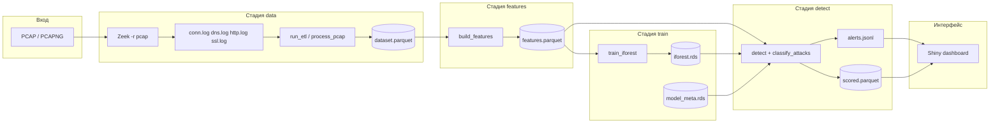

# Документация пакета `idsAiIstd` (каталог `R/`)

Пакет **IDS_AI-ISTD** реализует пакетный (batch) конвейер системы обнаружения вторжений (IDS) для сетевого трафика IoT: от PCAP-захватов до ML-скоринга, rule-based классификации атак и визуализации в Shiny-дашборде.

---

## Содержание

1. [Общая архитектура](#1-общая-архитектура)
2. [Логика работы конвейера](#2-логика-работы-конвейера)
3. [Глобальное состояние и конфигурация](#3-глобальное-состояние-и-конфигурация)
4. [Структура каталогов проекта](#4-структура-каталогов-проекта)
5. [Модули по файлам](#5-модули-по-файлам)
  - [idsAiIstd-package.R](#idsaiistd-packager)
  - [aaa.R](#aaar)
  - [config.R](#configr)
  - [utils.R](#utilsr)
  - [data-collection.R](#data-collectionr)
  - [feature-engineering.R](#feature-engineeringr)
  - [ml-training.R](#ml-trainingr)
  - [attack-detection.R](#attack-detectionr)
  - [pipeline-runner.R](#pipeline-runnerr)
  - [pcap-upload.R](#pcap-uploadr)
  - [dashboard.R](#dashboardr)
6. [Публичный API](#6-публичный-api)
7. [Способы запуска](#7-способы-запуска)
8. [Зависимости](#8-зависимости)

---

## Быстрый старт

1. Перед стартом:
  Убедиться в наличии Zeek в path вашей системы!
  Первый запуск без PCAP упадёт на стадии data — нужен хотя бы один .pcap в 
  ```R
  R Проект/data/pcap/
  ```
2. Установить пакет с github
  ```R
  install.packages("remotes")
  ```
  ```R
  remotes::install_github("ZWIYS/IDS_AI-ISTD")
  ```
3. Подключить пакет в R и указать путь
  ```R
  library(idsAiIstd)
  ```
  ```R
  init_ids_config("/Путь к R Проекту")
  ```
4. Добавление первого .pcap и запуск пайплайна
  Положить .pcap файл в /Проект R/data/pcap/
  ```R
  run_ids_pipeline()
  ```
5. Подключение дашборда
  ```R
  run_dashboard(port = 4321)
  ```
  или любой удобный вам порт

6*. Запуск docker контейнера
```
docker run --rm -it -p 4321:4321 \
  -v "$(pwd)/data:/app/data" \
  -v "$(pwd)/models:/app/models" \
  -v "$(pwd)/alerts:/app/alerts" \
  ghcr.io/zwiys/ids_ai-istd:<АКТУАЛЬНЫЙ ТЕГ> \
  bash -c "bash scripts/download_sample_pcaps.sh && Rscript run_pipeline.R && Rscript -e \"shiny::runApp('R/05_dashboard.R', port=4321, host='0.0.0.0')\""
```

## 1. Общая архитектура

Проект оформлен как R-пакет `idsAiIstd`. Весь исполняемый код конвейера сосредоточен в каталоге `R/`. Точки входа снаружи пакета:


| Точка входа          | Назначение                                                                   |
| -------------------- | ---------------------------------------------------------------------------- |
| `run_pipeline.R`     | CLI: последовательный запуск стадий `data` → `features` → `train` → `detect` |
| `run_dashboard()`    | Shiny UI: загрузка PCAP, запуск конвейера, графики и таблица алертов         |
| `run_ids_pipeline()` | Программный вызов тех же стадий из R или Shiny                               |





**Два слоя детектирования:**

1. **ML (Isolation Forest)** — без учителя; сессии с `anomaly_score` выше порога (`meta$threshold`) помечаются как `is_anomaly = TRUE`.
2. **Rule-based (`classify_attacks`)** — только для строк-алертов; присваивает `attack_type` и `attack_score` по эвристикам (DDoS, port scan, exfiltration и т.д.). Если правило не сработало, тип остаётся `ml_anomaly` (или значение `DETECT_PARAMS$rules$fallback_type`).

Zeek используется как **парсер PCAP → структурированные логи**; обучение и инференс выполняются в R (`isotree`, `recipes`, `arrow`).

---

## 2. Логика работы конвейера

### 2.1. Инициализация

При `library(idsAiIstd)` срабатывает `.onLoad()` в `idsAiIstd-package.R`: если в пространстве имён пакета ещё нет `PATHS`, вызывается `init_ids_config()` — создаются каталоги и задаются пути, гиперпараметры модели и пороги детектора.

Корень проекта (`PROJECT_ROOT`) определяется так:

1. Аргумент `root` в `init_ids_config(root = ...)`.
2. Переменные окружения `IDS_PROJECT_ROOT` или устаревшая `IDS_V2_ROOT`.
3. Иначе `getwd()`.

В CLI-скрипте `run_pipeline.R` корень принудительно выставляется в каталог, где лежит скрипт.

### 2.2. Стадия `data` (`run_etl`)

1. Сканируется `PATHS$pcap_dir` (или переданный `pcap_dir`) на файлы `*.pcap`, `*.pcapng`, с опциональным `.gz`.
2. Для каждого PCAP:
  - `run_zeek()` — запуск Zeek с кэшем по MD5 файла в `data/zeek_logs/<hash>/`.
  - `load_conn()` — чтение `conn.log`, переименование полей Zeek в `src_ip`, `dst_ip`, `src_port`, `dst_port`.
  - Обогащение по `uid`: DNS (`query_length`, `query_entropy`, `num_labels`), HTTP (`uri_length`, `ua_length`, `http_status_code`), SSL (`ssl_sni_length`, `ssl_sni_entropy`).
3. Результаты объединяются в одну `data.table` и пишутся в `**dataset.parquet`**.

Каждая строка — сетевая **сессия/соединение** (запись conn Zeek), не отдельный пакет.

### 2.3. Стадия `features` (`build_features`)

1. Читается `dataset.parquet`.
2. `add_conn_features()` — производные признаки на уровне сессии (`total_bytes`, `bytes_per_sec`, `pkt_ratio`, `history_length`).
3. `add_window_features()` — агрегаты в скользящем окне **300 с** (`DETECT_PARAMS$window_seconds`) по паре `(src_ip, bucket)`, где `bucket = floor(ts / window)`:
  - `conn_count_5min`, `dest_port_distinct`, `unique_dst_ip`, `bytes_5min`, `data_volume_change`.
4. `fill_defaults()` — заполнение пропусков константами из `FEATURE_DEFAULTS` и категорий `unknown`.
5. Запись в `**features.parquet`**.

### 2.4. Стадия `train` (`train_iforest`)

1. Из `features.parquet` берутся только колонки `NUM_FEATURES` + `CAT_FEATURES`.
2. `rsample::initial_split` 80/20; на train строится `recipes::recipe` (медианная импутация числовых, факторизация строк, `step_novel` для неизвестных уровней).
3. Обучается `isotree::isolation.forest` с параметрами из `MODEL_PARAMS`.
4. Порог аномальности — **99-й перцентиль** скоров на validation (`threshold_quant = 0.99`).
5. Сохраняются `**iforest.rds`** и `**model_meta.rds`** (порог, prep recipe, имена признаков, summary скоров, `trained_at`).

### 2.5. Стадия `detect` (`detect`)

1. Загружаются features, модель и meta.
2. Недостающие колонки для recipe дополняются; `fill_defaults()`.
3. `recipes::bake()` → предсказание `anomaly_score`; `is_anomaly = score > threshold`.
4. Полный результат — `**scored.parquet**`.
5. Подмножество с `is_anomaly == TRUE` проходит `classify_attacks()` → `**alerts.jsonl**` (по одной JSON-строке на алерт).

### 2.6. Shiny-дашборд

Пользователь загружает PCAP в `data/pcap/uploaded/`, нажимает «Запустить анализ» → `save_uploaded_pcaps()` + `run_ids_pipeline(pcap_dir = PATHS$pcap_upload_dir)`. После успеха обновляются графики и таблица из `scored.parquet` и `alerts.jsonl`.

---

## 3. Глобальное состояние и конфигурация

Переменные живут в **пространстве имён пакета** `idsAiIstd` (не в глобальном `.GlobalEnv`), задаются функцией `init_ids_config()`.

### 3.1. `PROJECT_ROOT`

Абсолютный путь к корню развёртывания: под ним ожидаются `data/`, `models/`, `alerts/`, `scripts/`.

### 3.2. `PATHS` (список путей)


| Ключ              | Путь по умолчанию                                    | Назначение                                                                     |
| ----------------- | ---------------------------------------------------- | ------------------------------------------------------------------------------ |
| `pcap_dir`        | `data/pcap`                                          | Входные PCAP для batch ETL (CLI)                                               |
| `pcap_upload_dir` | `data/pcap/uploaded`                                 | PCAP из Shiny                                                                  |
| `zeek_logs_dir`   | `data/zeek_logs`                                     | Кэш логов Zeek (подкаталог = MD5 PCAP)                                         |
| `processed_dir`   | `data/processed`                                     | Промежуточные parquet                                                          |
| `models_dir`      | `models`                                             | RDS модели                                                                     |
| `alerts_dir`      | `alerts`                                             | JSONL алертов                                                                  |
| `dataset`         | `.../dataset.parquet`                                | Сырой датасет после ETL                                                        |
| `features`        | `.../features.parquet`                               | Признаки для ML                                                                |
| `scored`          | `.../scored.parquet`                                 | Сессии со скорами и флагом аномалии                                            |
| `model_file`      | `models/iforest.rds`                                 | Isolation Forest                                                               |
| `meta_file`       | `models/model_meta.rds`                              | Метаданные и recipe                                                            |
| `alerts_file`     | `alerts/alerts.jsonl`                                | Поток алертов                                                                  |
| `block_script`    | `inst/scripts/block_ip.sh` или `scripts/block_ip.sh` | Скрипт блокировки IP (зарезервировано; `enable_blocking` по умолчанию `FALSE`) |


При инициализации все каталоги с суффиксом `_dir` создаются через `dir.create(..., recursive = TRUE)`.

### 3.3. `MODEL_PARAMS`


| Параметр          | Значение по умолчанию | Смысл                                                      |
| ----------------- | --------------------- | ---------------------------------------------------------- |
| `ntrees`          | 200                   | Число деревьев Isolation Forest                            |
| `sample_size`     | 256                   | Размер подвыборки на дерево (ограничивается `nrow(train)`) |
| `max_depth`       | 100                   | Максимальная глубина                                       |
| `ndim`            | 1                     | Размерность случайных подпространств                       |
| `contamination`   | 0.01                  | Зарезервировано в конфиге (порог задаётся через quantile)  |
| `threshold_quant` | 0.99                  | Квантиль скоров validation → порог аномалии                |
| `seed`            | 42                    | Воспроизводимость                                          |
| `nthreads`        | `detectCores() - 1`   | Потоки `isotree`                                           |


### 3.4. `DETECT_PARAMS`


| Параметр          | Значение | Смысл                                                                  |
| ----------------- | -------- | ---------------------------------------------------------------------- |
| `window_seconds`  | 300      | Окно агрегации по `src_ip` (5 минут)                                   |
| `alert_min_score` | 0.55     | Зарезервировано для фильтрации (в `detect()` не используется напрямую) |
| `enable_blocking` | FALSE    | Автоблокировка IP через `block_script`                                 |
| `dedup_seconds`   | 60       | Зарезервировано для дедупликации алертов                               |
| `rules`           | см. ниже | Пороги rule-based классификатора                                       |


`**DETECT_PARAMS$rules`:**


| Ключ            | Значение       | Использование                                                |
| --------------- | -------------- | ------------------------------------------------------------ |
| `adaptive_frac` | 0.75           | Доля от max в батче для адаптивных порогов (`.adaptive_min`) |
| `query_entropy` | 3.0            | DNS: подозрительная энтропия запроса                         |
| `query_length`  | 40             | DNS: длинный query                                           |
| `uri_length`    | 150            | HTTP: длинный URI                                            |
| `ssl_entropy`   | 3.0            | SSL: энтропия SNI                                            |
| `volume_pct`    | 150            | Рост объёма трафика между окнами, %                          |
| `fallback_type` | `"ml_anomaly"` | Тип атаки, если ни одно правило не сработало                 |


### 3.5. `ZEEK_BIN`

Путь к исполняемому файлу Zeek; по умолчанию из `Sys.getenv("ZEEK_BIN", "zeek")`.

### 3.6. Признаки (`feature-engineering.R`)

`**FEATURE_DEFAULTS`** — словарь значений по умолчанию для всех числовых признаков.

`**NUM_FEATURES`** — имена числовых признаков (равны `names(FEATURE_DEFAULTS)`):

- Сессия: `duration`, `orig_bytes`, `resp_bytes`, `missed_bytes`, `orig_pkts`, `resp_pkts`, `total_bytes`, `bytes_per_sec`, `pkt_ratio`, `history_length`
- DNS/HTTP/SSL: `query_length`, `query_entropy`, `num_labels`, `uri_length`, `ua_length`, `http_status_code`, `ssl_sni_length`, `ssl_sni_entropy`
- Окно: `conn_count_5min`, `dest_port_distinct`, `unique_dst_ip`, `bytes_5min`, `data_volume_change`

`**CAT_FEATURES**`: `proto`, `service`, `conn_state` — номинальные признаки для recipe.

---

## 4. Структура каталогов проекта

```
IDS_AI-ISTD/
├── R/                    # исходники пакета (эта документация)
├── data/
│   ├── pcap/             # PCAP для CLI
│   ├── pcap/uploaded/    # PCAP из дашборда
│   ├── zeek_logs/        # кэш Zeek
│   └── processed/        # parquet
├── models/               # iforest.rds, model_meta.rds
├── alerts/               # alerts.jsonl
├── scripts/              # block_ip.sh и вспомогательные shell
├── run_pipeline.R        # CLI-оркестратор
├── inst/scripts/         # block_ip.sh внутри пакета
└── tests/testthat/       # unit-тесты
```

---

## 5. Модули по файлам

### idsAiIstd-package.R

**Назначение:** метаданные пакета и хук загрузки.


| Элемент                              | Описание                                                             |
| ------------------------------------ | -------------------------------------------------------------------- |
| `"_PACKAGE"`                         | Стандартный маркер пакета для roxygen                                |
| `@import data.table`                 | Импорт всего пакета `data.table`                                     |
| `@importFrom stats predict quantile` | Для ML и порога                                                      |
| `@importFrom utils head tail`        | Вспомогательные функции                                              |
| `.onLoad(libname, pkgname)`          | При загрузке вызывает `init_ids_config()`, если `PATHS` ещё не задан |


Публичных функций не экспортирует.

---

### aaa.R

**Назначение:** подавление предупреждений R CMD check о **неявных переменных** (NSE) в `data.table` и Shiny.

`utils::globalVariables(c(...))` объявляет символы вроде `src_ip`, `attack_type`, `i.conn_count_5min`, `PATHS`, `PROJECT_ROOT`, которые используются внутри `dt[, ...]` и реактивов Shiny, но не являются локальными переменными R.

Файл не содержит исполняемой логики конвейера.

---

### config.R

**Назначение:** единая точка конфигурации путей и гиперпараметров.

#### Функции


| Функция                        | Экспорт  | Описание                                                                                              |
| ------------------------------ | -------- | ----------------------------------------------------------------------------------------------------- |
| `init_ids_config(root = NULL)` | да       | Инициализирует `PROJECT_ROOT`, `PATHS`, `MODEL_PARAMS`, `DETECT_PARAMS`, `ZEEK_BIN`; создаёт каталоги |
| `.pkg_assign(name, value, ns)` | internal | Безопасная перезапись привязки в namespace (разблокировка locked binding)                             |
| `.default_project_root()`      | internal | Чтение env или `getwd()`                                                                              |


#### Логика `init_ids_config`

1. Нормализует `root`.
2. Ищет `block_ip.sh` в `system.file("scripts", ...)` пакета, иначе в `root/scripts/`.
3. Собирает список `paths`, создаёт директории `*_dir`.
4. Записывает константы в `asNamespace("idsAiIstd")`.
5. Возвращает невидимый список с теми же полями (удобно для отладки).

---

### utils.R

**Назначение:** логирование, безопасная арифметика, чтение Zeek TSV, вспомогательные операции с колонками.

#### Оператор и логирование


| Имя                                            | Тип      | Описание                                   |
| ---------------------------------------------- | -------- | ------------------------------------------ |
| `%                                             |          | %`                                         |
| `log_msg`, `log_info`, `log_warn`, `log_error` | internal | Печать в stdout с меткой времени и уровнем |


#### Экспортируемые функции


| Функция                    | Описание                                      |
| -------------------------- | --------------------------------------------- |
| `safe_num(x)`              | `as.numeric` с заменой NA/Inf на 0            |
| `safe_max(x, default = 0)` | `max` по конечным значениям или `default`     |
| `shannon_entropy(s)`       | Энтропия Шеннона строки (биты); пустая/NA → 0 |
| `shannon_entropy_v(strs)`  | Векторизованная энтропия для вектора строк    |


#### Внутренние функции


| Функция                          | Описание                                                                                                       |
| -------------------------------- | -------------------------------------------------------------------------------------------------------------- |
| `read_zeek_tsv(path)`            | Парсинг Zeek ASCII log: строки `#fields` → имена колонок; данные через `fread`; NA = `-`, `(empty)`, `(unset)` |
| `safe_col(dt, name, default, n)` | Колонка `name` или вектор `default` длины `n`                                                                  |
| `load_rds_or_null(path)`         | `readRDS` если файл есть, иначе `NULL`                                                                         |


---

### data-collection.R

**Назначение:** ETL — PCAP → Zeek → объединённые таблицы → `dataset.parquet`.

#### Внутренние функции


| Функция                   | Описание                                                                                                     |
| ------------------------- | ------------------------------------------------------------------------------------------------------------ |
| `run_zeek(pcap_path)`     | Запуск Zeek `-r <pcap>` в изолированной директории-кэше; маркер `.done`; timeout 600 с через `processx::run` |
| `load_conn(zeek_dir)`     | `conn.log` → data.table с нормализованными IP/портами и числовыми полями                                     |
| `enrich_dns(zeek_dir)`    | Агрегат DNS-метрик по `uid`                                                                                  |
| `enrich_http(zeek_dir)`   | Агрегат HTTP-метрик по `uid`                                                                                 |
| `enrich_ssl(zeek_dir)`    | Агрегат SSL/SNI по `uid`                                                                                     |
| `join_uid(conn, aux)`     | Left join вспомогательной таблицы по `uid` через data.table syntax `conn[aux, on = "uid"]`                   |
| `process_pcap(pcap_path)` | Полный цикл для одного файла + колонка `source_file`                                                         |


#### Экспорт


| Функция                       | Описание                                                                                                              |
| ----------------------------- | --------------------------------------------------------------------------------------------------------------------- |
| `run_etl(pcap_dir, out_path)` | Обработка всех PCAP в каталоге; ошибки по файлам логируются, не останавливают весь ETL; `rbindlist` → `write_parquet` |


#### Важные поля после ETL (conn + enrichments)


| Поле                                                         | Источник | Смысл                              |
| ------------------------------------------------------------ | -------- | ---------------------------------- |
| `uid`                                                        | Zeek     | Идентификатор сессии для join      |
| `ts`                                                         | conn     | Временная метка (Unix)             |
| `src_ip`, `dst_ip`, `src_port`, `dst_port`                   | conn     | Конечные точки                     |
| `duration`, `orig_bytes`, `resp_bytes`, ...                  | conn     | Статистика соединения              |
| `proto`, `service`, `conn_state`, `history`                  | conn     | Протокол и состояние               |
| `query_`*, `num_labels`                                      | dns      | Признаки DNS (если был DNS на uid) |
| `uri_length`, `ua_length`, `http_status_code`, `http_method` | http     | HTTP-признаки                      |
| `ssl_sni_length`, `ssl_sni_entropy`                          | ssl      | TLS SNI                            |
| `source_file`                                                | код      | Имя исходного PCAP                 |


---

### feature-engineering.R

**Назначение:** построение признаков для обучения и детектирования.

#### Константы

См. раздел [3.6](#36-признаки-feature-engineeringr): `FEATURE_DEFAULTS`, `NUM_FEATURES`, `CAT_FEATURES`.

#### Внутренние функции


| Функция                        | Описание                                                                         |
| ------------------------------ | -------------------------------------------------------------------------------- |
| `add_conn_features(dt)`        | `total_bytes`, `bytes_per_sec`, `pkt_ratio`, `history_length`                    |
| `add_window_features(dt, win)` | Агрегаты по `(src_ip, bucket)`; join обратно в `dt`; удаление временной `bucket` |
| `fill_defaults(dt)`            | Числовые — из `FEATURE_DEFAULTS`; категориальные — `"unknown"`                   |


#### Производные признаки окна


| Признак              | Формула / смысл                                                         |
| -------------------- | ----------------------------------------------------------------------- |
| `conn_count_5min`    | Число соединений от `src_ip` в окне                                     |
| `dest_port_distinct` | Число уникальных `dst_port`                                             |
| `unique_dst_ip`      | Число уникальных `dst_ip`                                               |
| `bytes_5min`         | Сумма `total_bytes` в окне                                              |
| `data_volume_change` | % изменение `bytes_5min` относительно предыдущего окна того же `src_ip` |


#### Экспорт


| Функция                             | Описание                                                     |
| ----------------------------------- | ------------------------------------------------------------ |
| `build_features(in_path, out_path)` | Читает dataset, применяет три шага, пишет `features.parquet` |


---

### ml-training.R

**Назначение:** обучение Isolation Forest с препроцессингом tidymodels.

#### Экспорт


| Функция                                               | Описание                          |
| ----------------------------------------------------- | --------------------------------- |
| `train_iforest(features_path, model_path, meta_path)` | Полный цикл обучения и сохранения |


#### Шаги обучения

1. Отбор колонок `NUM_FEATURES` + `CAT_FEATURES`.
2. Recipe: медиана для numeric, string→factor, `step_novel` для новых уровней факторов.
3. `isolation.forest(..., missing_action = "fail")` — пропуски должны быть устранены recipe.
4. Порог = `quantile(scores_val, 0.99)`.

#### `model_meta.rds` (список)


| Поле            | Описание                                                       |
| --------------- | -------------------------------------------------------------- |
| `threshold`     | Порог `anomaly_score` для `is_anomaly`                         |
| `recipe`        | Объект `recipe` после `prep()` — нужен для `bake()` при detect |
| `features`      | Имена колонок после bake (порядок для модели)                  |
| `score_summary` | `summary()` скоров на validation                               |
| `trained_at`    | Время обучения                                                 |


---

### attack-detection.R

**Назначение:** инференс ML, классификация типов атак, запись алертов.

#### Внутренние функции


| Функция                                   | Описание                                                                                     |
| ----------------------------------------- | -------------------------------------------------------------------------------------------- |
| `.adaptive_min(x, base, frac, floor_val)` | `max(floor, min(base, ceiling(max(x)*frac)))` — адаптивные пороги под масштаб текущего батча |
| `.ensure_rule_cols(dt)`                   | Гарантирует наличие колонок для правил с дефолтами из `FEATURE_DEFAULTS`                     |


#### Rule-based: `classify_attacks(dt, rules)`

Инициализация: `attack_score = 1`, `attack_type = fallback_type`.

Правила применяются **последовательно**; более ранние жёсткие правила могут быть перезаписаны поздними только если `attack_type` всё ещё `fallback_type` (для большинства правил).


| `attack_type`   | Условия (упрощённо)                  | `attack_score` |
| --------------- | ------------------------------------ | -------------- |
| `ddos`          | Много conn, мало портов назначения   | 3–4            |
| `port_scan`     | Много conn и много разных портов     | 2–3            |
| `exfiltration`  | Большой исходящий объём, малый ответ | 2–3            |
| `botnet`        | Много уникальных `dst_ip`            | 2–3            |
| `dos`           | Короткие сессии, высокая частота     | 2–3            |
| `dns_anomaly`   | Высокая энтропия/длина query         | 2              |
| `http_anomaly`  | Длинный URI или status ≥ 400         | 2              |
| `ssl_anomaly`   | Высокая энтропия SNI                 | 2              |
| `traffic_spike` | `data_volume_change` ≥ `volume_pct`  | 2              |
| `proxy_tunnel`  | `service` ∈ {`irc`, `socks`}         | 2              |
| `ml_anomaly`    | Ни одно правило не сработало         | 1              |


Алиас: `classify_attack <- classify_attacks`.

#### Экспорт


| Функция                                        | Описание                                                                     |
| ---------------------------------------------- | ---------------------------------------------------------------------------- |
| `send_alerts(alerts, append)`                  | JSONL в `PATHS$alerts_file`; каждая строка — один alert                      |
| `detect(features_path, model_path, meta_path)` | Скоринг → `scored.parquet` → фильтр аномалий → классификация → `send_alerts` |


#### Поля после `detect`


| Поле            | Описание                                            |
| --------------- | --------------------------------------------------- |
| `anomaly_score` | Выход Isolation Forest (чем выше, тем «аномальнее») |
| `is_anomaly`    | Логический флаг выше порога                         |
| `attack_score`  | 1–4, важность по правилам                           |
| `attack_type`   | Строковый класс атаки                               |


---

### pipeline-runner.R

**Назначение:** оркестрация стадий.

#### Константа

```r
STAGE_MAP <- list(
  data     = run_etl,
  features = build_features,
  train    = train_iforest,
  detect   = detect
)
```

#### Экспорт: `run_ids_pipeline(stages, pcap_dir, reset_alerts)`


| Аргумент       | По умолчанию | Описание                                              |
| -------------- | ------------ | ----------------------------------------------------- |
| `stages`       | все четыре   | Подмножество имён стадий                              |
| `pcap_dir`     | NULL         | Если задан и стадия `data` — передаётся в `run_etl()` |
| `reset_alerts` | TRUE         | Перед `detect` очищает `alerts.jsonl`                 |


Для каждой стадии: лог начала/времени, `do.call(fn, args)`.

---

### pcap-upload.R

**Назначение:** работа с пользовательскими PCAP в Shiny (безопасные имена, очередь файлов).

#### Константа

`PCAP_NAME_RE <- "\\.(pcap|pcapng)(\\.gz)?$"` — допустимые расширения.

#### Экспорт


| Функция                                         | Описание                                                                     |
| ----------------------------------------------- | ---------------------------------------------------------------------------- |
| `safe_pcap_filename(name)`                      | `basename`, санитизация символов, добавление `.pcap` при необходимости       |
| `list_pcaps(dir)`                               | Отсортированный список полных путей в `pcap_upload_dir`                      |
| `clear_pcaps(dir)`                              | Удаление всех PCAP в каталоге                                                |
| `save_uploaded_pcaps(files, replace, dest_dir)` | Копирование из `fileInput$datapath`; при коллизии имён — суффикс с timestamp |


---

### dashboard.R

**Назначение:** интерактивный UI на Shiny + bslib + plotly + DT.

#### Внутренние функции


| Функция                   | Описание                                    |
| ------------------------- | ------------------------------------------- |
| `.check_dashboard_deps()` | Проверка Suggests: shiny, DT, plotly, bslib |
| `load_scored()`           | Чтение `PATHS$scored` или пустая table      |
| `load_alerts()`           | Парсинг JSONL в data.table                  |


#### Экспорт


| Функция                          | Описание                                                          |
| -------------------------------- | ----------------------------------------------------------------- |
| `ids_dashboard_app()`            | Возвращает `shiny::shinyApp(ui, server)`                          |
| `run_dashboard(port, host, ...)` | `runApp` на порту 4321, `host = "0.0.0.0"`, лимит загрузки 500 MB |


#### UI-элементы и реактивная логика


| ID / реактив                  | Назначение                                                    |
| ----------------------------- | ------------------------------------------------------------- |
| `pcap_upload`                 | `fileInput` для PCAP                                          |
| `replace_pcaps`               | Очистка каталога перед новой загрузкой                        |
| `run_pipeline`                | Запуск `run_ids_pipeline` в фоне с `sink` лога                |
| `refresh`                     | Перечитать scored/alerts                                      |
| `attack_filter`, `score_min`  | Фильтры таблицы и метрик                                      |
| `rv$scored`, `rv$alerts`      | Реактивное хранилище данных                                   |
| `filtered_alerts()`           | Применение фильтров                                           |
| Графики `hist`, `ts`, `topip` | Гистограмма скоров, алерты по времени, топ src_ip             |
| `alerts_tbl`                  | DT с колонками ts, IP, ports, attack_type, scores, агрегатами |


При успешном анализе вызывается `refresh_dashboard()` и обновляется список типов атак в `selectInput`.

---

## 6. Публичный API

Экспортируемые функции (см. `NAMESPACE`):


| Функция                                                                  | Модуль              |
| ------------------------------------------------------------------------ | ------------------- |
| `init_ids_config`                                                        | config              |
| `run_etl`                                                                | data-collection     |
| `build_features`                                                         | feature-engineering |
| `train_iforest`                                                          | ml-training         |
| `detect`                                                                 | attack-detection    |
| `classify_attacks`, `classify_attack`                                    | attack-detection    |
| `send_alerts`                                                            | attack-detection    |
| `run_ids_pipeline`                                                       | pipeline-runner     |
| `safe_num`, `safe_max`, `shannon_entropy`                                | utils               |
| `safe_pcap_filename`, `list_pcaps`, `clear_pcaps`, `save_uploaded_pcaps` | pcap-upload         |
| `ids_dashboard_app`, `run_dashboard`                                     | dashboard           |


Внутренние функции и константы (`run_zeek`, `PATHS`, `STAGE_MAP`, …) доступны только внутри пакета или при явном обращении к namespace в отладке.

---

## 7. Способы запуска

### CLI

```bash
Rscript run_pipeline.R
Rscript run_pipeline.R --pcap-dir data/pcap/uploaded
Rscript run_pipeline.R data features train detect
```

Переменная окружения перед запуском:

```bash
export IDS_PROJECT_ROOT=/path/to/project
```

### R (интерактивно)

```r
library(idsAiIstd)
init_ids_config("/path/to/project")
run_ids_pipeline(stages = c("data", "features", "train", "detect"))
```

### Дашборд

```r
idsAiIstd::run_dashboard(port = 4321, host = "0.0.0.0")
```

### Docker Compose

- Сервис `pipeline`: `Rscript run_pipeline.R`
- Сервис `dashboard`: порт **4321**, тома `data`, `models`, `alerts`

---

## 8. Зависимости

### Imports (обязательные)


| Пакет                | Роль в проекте                                  |
| -------------------- | ----------------------------------------------- |
| `data.table`         | Высокопроизводительные таблицы, join, агрегации |
| `arrow`              | Parquet I/O                                     |
| `digest`             | MD5-ключ кэша Zeek                              |
| `processx`           | Запуск Zeek как subprocess                      |
| `jsonlite`           | Сериализация алертов                            |
| `stringi`            | Подсчёт меток в DNS query                       |
| `isotree`            | Isolation Forest                                |
| `recipes`, `rsample` | Препроцессинг и split                           |


### Suggests (дашборд и тесты)

`shiny`, `DT`, `plotly`, `bslib`, `testthat`

### Внешние бинарники

- **Zeek** — должен быть в `PATH` или задан через `ZEEK_BIN`.

---

## Связь файлов (краткая схема)

```
idsAiIstd-package.R  →  .onLoad → config.R
run_pipeline.R / dashboard.R  →  pipeline-runner.R
pipeline-runner.R  →  data-collection → feature-engineering → ml-training → attack-detection
dashboard.R  →  pcap-upload.R + pipeline-runner.R
Все модули  →  utils.R, config (PATHS, PARAMS)
aaa.R  →  только NSE для check
```

