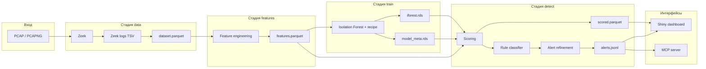

# IDS AI-ISTD

**IoT Intrusion Detection System** — R-пакет `idsAiIstd` для анализа сетевого трафика IoT-устройств: разбор PCAP через [Zeek](https://zeek.org/), построение признаков, обнаружение аномалий моделью **Isolation Forest** и rule-based классификация типов атак. Результаты доступны в виде Parquet-артефактов, JSONL-алертов и интерактивного **Shiny**-дашборда; опционально — интеграция с **MCP** (Cursor / AI-агенты).

| Поле | Значение |
|------|----------|
| Версия пакета | `0.1.0` |
| Минимальная версия R | `4.2.0` (CI/Docker: `4.3.2`) |
| Лицензия | MIT |
| Репозиторий | [ZWIYS/IDS_AI-ISTD](https://github.com/ZWIYS/IDS_AI-ISTD) |

**Авторы:** A.A. Kulikov, A.A. Oglodin, V.V. Pastukhov, P.S. Plyuvkov, D.V. Toykina (см. `DESCRIPTION`).

---

## Содержание

1. [Назначение и возможности](#назначение-и-возможности)
2. [Архитектура](#архитектура)
3. [Структура проекта](#структура-проекта)
4. [Конвейер обработки](#конвейер-обработки)
5. [Конфигурация и переменные](#конфигурация-и-переменные)
6. [Признаки (features)](#признаки-features)
7. [Модель и детектирование](#модель-и-детектирование)
8. [Типы атак и правила](#типы-атак-и-правила)
9. [Форматы данных](#форматы-данных)
10. [Установка](#установка)
11. [Быстрый старт](#быстрый-старт)
12. [CLI и Docker](#cli-и-docker)
13. [Shiny-дашборд](#shiny-дашборд)
14. [MCP-сервер](#mcp-сервер)
15. [Публичный API пакета](#публичный-api-пакета)
16. [Тестирование и CI](#тестирование-и-ci)
17. [Зависимости](#зависимости)
18. [Детали ETL и логи Zeek](#детали-etl-и-логи-zeek)
19. [Адаптивные пороги и attack_score](#адаптивные-пороги-и-attack_score)
20. [Типовые сценарии запуска](#типовые-сценарии-запуска)
21. [Примеры артефактов](#примеры-артефактов)
22. [Дашборд: интерфейс и REPL](#дашборд-интерфейс-и-repl)
23. [Логирование и отладка](#логирование-и-отладка)
24. [Устранение неполадок](#устранение-неполадок)

---

## Назначение и возможности

Система предназначена для **офлайн/batch-анализа** захватов трафика (`.pcap`, `.pcapng`, сжатые `.gz`):

- Парсинг PCAP средствами **Zeek** (`conn.log`, `dns.log`, `http.log`, `ssl.log`).
- Обогащение сессий DNS/HTTP/TLS-признаками и агрегатами по временным окнам (5 минут по умолчанию).
- Обучение **Isolation Forest** (`isotree`) с препроцессингом **tidymodels/recipes**.
- Скоринг сессий, фильтрация алертов (порог, margin, дедупликация, квантиль ML-аномалий).
- **Rule-based** назначение типа атаки (`ddos`, `port_scan`, …) поверх ML-скора.
- Визуализация и загрузка PCAP через Shiny; опционально — MCP-инструменты для агентов.

> **Важно:** Zeek должен быть доступен в `PATH` (или задан через `ZEEK_BIN`). Первый запуск без PCAP в `data/pcap/` завершится ошибкой на стадии `data`.

### Ограничения и допущения

- Конвейер **не является inline-NIDS**: анализ идёт по уже записанным PCAP, а не по live-интерфейсу.
- Одна строка `conn.log` ≈ одна **сессия/соединение** Zeek; агрегаты «за 5 минут» считаются по `src_ip` внутри батча, а не по скользящему окну в реальном времени.
- Модель обучается на **всех** сессиях в `features.parquet` (unsupervised); меток «норма/атака» в обучении нет.
- Rule-based слой **не заменяет** ML: он уточняет тип только для сессий, уже прошедших порог Isolation Forest.
- При очень маленьких PCAP адаптивные правила срабатывают на сниженных порогах (см. [адаптивные пороги](#адаптивные-пороги-и-attack_score)) — возможны ложные срабатывания на демо-трейсах Zeek.

---

## Архитектура

### Общая схема



### Слои кода (R-пакет `idsAiIstd`)

| Модуль | Файл | Роль |
|--------|------|------|
| Конфигурация | `R/config.R` | Пути, `MODEL_PARAMS`, `DETECT_PARAMS`, `ZEEK_BIN` |
| ETL | `R/data-collection.R` | Zeek, чтение логов, `dataset.parquet` |
| Признаки | `R/feature-engineering.R` | Агрегаты, окна, `features.parquet` |
| Обучение | `R/ml-training.R` | Isolation Forest, метаданные модели |
| Детект | `R/attack-detection.R` | Скоринг, классификация, алерты |
| Каталог атак | `R/attack-catalog.R` | Описания типов, `explain_alert()` |
| Оркестратор | `R/pipeline-runner.R` | `run_ids_pipeline()` |
| Дашборд | `R/dashboard.R`, `R/dashboard-repl.R` | Shiny UI + безопасная REPL |
| PCAP upload | `R/pcap-upload.R` | Загрузка файлов в дашборде |
| MCP | `R/mcp-server.R`, `inst/mcp/*` | stdio-сервер для Cursor |
| Утилиты | `R/utils.R` | Логи, Zeek TSV, энтропия, `safe_num` |
| Точка входа CLI | `run_pipeline.R` | `Rscript run_pipeline.R` |

При загрузке пакета (`.onLoad`) вызывается `init_ids_config()` с корнем из `IDS_PROJECT_ROOT` / `IDS_V2_ROOT` или `getwd()`.

---

## Структура проекта

После `init_ids_config("/path/to/project")` создаются каталоги и файлы:

```
/project_root/
├── data/
│   ├── pcap/              # исходные PCAP (ETL по умолчанию)
│   │   └── uploaded/      # загрузки из Shiny / MCP pipeline
│   ├── zeek_logs/         # кэш логов Zeek (подкаталог = MD5 PCAP)
│   └── processed/
│       ├── dataset.parquet
│       ├── features.parquet
│       └── scored.parquet
├── models/
│   ├── iforest.rds        # обученная Isolation Forest
│   └── model_meta.rds     # порог, recipe, список признаков
├── alerts/
│   ├── alerts.jsonl       # алерты (JSON Lines)
│   └── blocks.log         # лог «блокировок» (если enable_blocking)
├── scripts/
│   ├── block_ip.sh
│   ├── download_sample_pcaps.sh
│   └── import_pcaps.sh
├── R/                     # исходники пакета
├── inst/
│   ├── mcp/               # MCP tools и пример конфига Cursor
│   └── scripts/block_ip.sh
├── tests/
├── run_pipeline.R
├── docker-compose.yml
└── Dockerfile
```

---

## Конвейер обработки

### Стадии

Функция `run_ids_pipeline(stages, pcap_dir, reset_alerts)` последовательно вызывает:

| Стадия | Функция | Вход | Выход |
|--------|---------|------|-------|
| `data` | `run_etl()` | `data/pcap/*.pcap*` | `data/processed/dataset.parquet` |
| `features` | `build_features()` | `dataset.parquet` | `features.parquet` |
| `train` | `train_iforest()` | `features.parquet` | `models/iforest.rds`, `models/model_meta.rds` |
| `detect` | `detect()` | `features.parquet` + модель | `scored.parquet`, `alerts/alerts.jsonl` |

Параметры:

- **`stages`** — вектор имён стадий; по умолчанию все четыре.
- **`pcap_dir`** — если задан, передаётся только в `run_etl()` (иначе `PATHS$pcap_dir`).
- **`reset_alerts`** — при `TRUE` и наличии стадии `detect` файл `alerts.jsonl` очищается перед записью.

### ETL (стадия `data`)

1. Для каждого PCAP вычисляется **MD5** файла → каталог кэша `data/zeek_logs/<hash>/`.
2. Если есть маркер `.done`, Zeek не перезапускается.
3. Zeek: `zeek -r <pcap> LogAscii::use_json=F` (таймаут 600 с, `processx`).
4. Загружается `conn.log`, переименовываются поля Zeek → `src_ip`, `dst_ip`, `src_port`, `dst_port`.
5. По `uid` джойнятся обогащения из `dns.log`, `http.log`, `ssl.log`.
6. Все PCAP объединяются в один `dataset.parquet` (`arrow`).

Ошибка на одном PCAP не останавливает весь ETL: сбой логируется (`log_error`), файл пропускается. Если ни один PCAP не обработан — `stop("ETL produced zero rows")`.

### Стадия `features`

- Производные по соединению: `total_bytes`, `bytes_per_sec`, `pkt_ratio`, `history_length`.
- Оконные агрегаты по `(src_ip, bucket)` где `bucket = floor(ts / window_seconds)`.
- Заполнение пропусков константами из `FEATURE_DEFAULTS`.

### Стадия `train`

- Split 80/20 (`rsample::initial_split`).
- Recipe: медианная импутация числовых, `string2factor` + `step_novel` для категорий.
- `isotree::isolation.forest` на baked-признаках.
- Порог аномалии = квантиль `threshold_quant` скоров на валидации.

### Стадия `detect`

1. Bake признаков по сохранённому recipe.
2. `anomaly_score`, флаг `is_anomaly` (score > threshold).
3. Запись `scored.parquet`.
4. Подмножество аномалий → `classify_attacks()` → `.refine_alerts()` → `send_alerts()` (JSONL).

---

## Конфигурация и переменные

### Инициализация

```r
library(idsAiIstd)
init_ids_config("/абсолютный/путь/к/корню/проекта")
```

Возвращает (невидимо) список с `PROJECT_ROOT`, `PATHS`, `MODEL_PARAMS`, `DETECT_PARAMS`, `ZEEK_BIN`. Те же объекты сохраняются в namespace пакета и доступны внутри функций как `PATHS`, `MODEL_PARAMS` и т.д.

### Переменные окружения

| Переменная | Назначение |
|------------|------------|
| `IDS_PROJECT_ROOT` | Корень проекта (приоритет для `init_ids_config`) |
| `IDS_V2_ROOT` | Устаревший алиас того же |
| `ZEEK_BIN` | Путь к бинарнику Zeek (по умолчанию `"zeek"`) |
| `INSTALL_SUGGESTS` | `false` — не ставить Shiny/MCP при `install_dependencies.R` |
| `RSPM` | CRAN-репозиторий (Docker/CI: Posit PM Jammy) |
| `IDS_MCP_TOOLS` | Путь к `ids_tools.R` для MCP |

### `PATHS` (список путей)

| Ключ | Путь (относительно `PROJECT_ROOT`) |
|------|-------------------------------------|
| `pcap_dir` | `data/pcap` |
| `pcap_upload_dir` | `data/pcap/uploaded` |
| `zeek_logs_dir` | `data/zeek_logs` |
| `processed_dir` | `data/processed` |
| `models_dir` | `models` |
| `alerts_dir` | `alerts` |
| `dataset` | `data/processed/dataset.parquet` |
| `features` | `data/processed/features.parquet` |
| `scored` | `data/processed/scored.parquet` |
| `model_file` | `models/iforest.rds` |
| `meta_file` | `models/model_meta.rds` |
| `alerts_file` | `alerts/alerts.jsonl` |
| `block_script` | `inst/scripts/block_ip.sh` или `scripts/block_ip.sh` |

Каталоги с суффиксом `_dir` создаются автоматически при `init_ids_config()`.

### `MODEL_PARAMS` (обучение Isolation Forest)

| Параметр | По умолчанию | Описание |
|----------|--------------|----------|
| `ntrees` | `200` | Число деревьев |
| `sample_size` | `256` | Размер подвыборки (ограничивается размером train) |
| `max_depth` | `100` | Максимальная глубина |
| `ndim` | `1` | Размерность подпространства |
| `contamination` | `0.01` | Зарезервировано в конфиге (порог задаётся через квантиль) |
| `threshold_quant` | `0.995` | Квантиль скоров на validation → порог аномалии |
| `seed` | `42` | Seed для воспроизводимости |
| `nthreads` | `detectCores() - 1` | Потоки `isotree` (минимум 1) |

### `DETECT_PARAMS` (детект и алерты)

| Параметр | По умолчанию | Описание |
|----------|--------------|----------|
| `window_seconds` | `300` | Длина окна агрегации (5 мин) |
| `alert_min_score` | `0` | Минимальный `anomaly_score` для алерта |
| `score_margin` | `0.02` | Алерт только если `score > threshold + margin` |
| `ml_score_quantile` | `0.80` | Для типа `ml_anomaly` — отсечение по квантилю score среди алертов |
| `enable_blocking` | `FALSE` | Вызов `block_ip.sh` (заглушка) |
| `dedup_seconds` | `120` | Дедупликация по `(src_ip, attack_type, floor(ts/dedup))` |
| `rules` | см. ниже | Пороги rule-based классификатора |

#### `DETECT_PARAMS$rules`

| Ключ | Значение | Использование |
|------|----------|---------------|
| `adaptive_frac` | `0.75` | Доля от max в батче для адаптивных порогов |
| `query_entropy` | `3.0` | DNS: энтропия запроса |
| `query_length` | `40` | DNS: длина имени |
| `uri_length` | `150` | HTTP: длина URI |
| `ssl_entropy` | `3.0` | TLS SNI: энтропия |
| `volume_pct` | `150` | Рост объёма трафика, % |
| `fallback_type` | `"ml_anomaly"` | Тип, если правила не сработали |

Изменение параметров после загрузки пакета (для продвинутых сценариев):

```r
init_ids_config("/path/to/project")
ns <- as.environment("package:idsAiIstd")
ns$DETECT_PARAMS$score_margin <- 0.05
ns$MODEL_PARAMS$ntrees <- 300L
```

---

## Признаки (features)

### Числовые (`NUM_FEATURES` / `FEATURE_DEFAULTS`)

| Признак | Описание | Default |
|---------|----------|---------|
| `duration` | Длительность соединения | 0 |
| `orig_bytes`, `resp_bytes`, `missed_bytes` | Байты Zeek conn | 0 |
| `orig_pkts`, `resp_pkts` | Пакеты | 0 |
| `total_bytes` | orig + resp | 0 |
| `bytes_per_sec` | total_bytes / duration | 0 |
| `pkt_ratio` | orig_pkts / resp_pkts | 0 |
| `history_length` | Длина поля history | 0 |
| `uri_length`, `ua_length`, `http_status_code` | HTTP | 0 |
| `query_length`, `query_entropy`, `num_labels` | DNS | 0 |
| `ssl_sni_length`, `ssl_sni_entropy` | TLS SNI | 0 |
| `conn_count_5min` | Число соединений src в окне | 0 |
| `dest_port_distinct` | Уникальные порты назначения в окне | 0 |
| `unique_dst_ip` | Уникальные IP назначения в окне | 0 |
| `bytes_5min` | Сумма bytes в окне | 0 |
| `data_volume_change` | % изменение bytes к предыдущему окну | 0 |

### Категориальные (`CAT_FEATURES`)

- `proto`, `service`, `conn_state` — пустые/NA → `"unknown"`.

### Поля из Zeek (в `dataset.parquet`)

Типичные колонки после ETL: `ts`, `uid`, `src_ip`, `src_port`, `dst_ip`, `dst_port`, `proto`, `service`, `conn_state`, `history`, поля обогащения DNS/HTTP/SSL, `source_file`.

---

## Модель и детектирование

### Isolation Forest

- Библиотека: **`isotree`**.
- Препроцессинг: **`recipes`** (импутация, факторизация, обработка новых уровней).
- В `model_meta.rds`: `threshold`, `recipe`, `features` (имена колонок после bake), `score_summary`, `trained_at`.

### Порог и скоринг

- `anomaly_score` — выход `predict(..., type = "score")` (чем выше, тем аномальнее).
- `is_anomaly = (anomaly_score > threshold)`.

### Уточнение алертов (`.refine_alerts`)

1. Отсечение по `threshold + score_margin`.
2. Фильтр `alert_min_score`.
3. Для `ml_anomaly`: оставить только с score ≥ квантиля `ml_score_quantile` среди текущих алертов.
4. Дедупликация: одна запись на `(src_ip, attack_type, bucket)` с максимальным score.

### Блокировка IP

При `DETECT_PARAMS$enable_blocking = TRUE` может вызываться `scripts/block_ip.sh` (сейчас **заглушка** — запись в `alerts/blocks.log`). Для продакшена раскомментируйте `iptables` / `pfctl` в скрипте.

---

## Типы атак и правила

Классификатор `classify_attacks()` сначала применяет **строгие** правила, затем **адаптивные** (пороги от `.adaptive_min()`), затем правила по DNS/HTTP/SSL/трафику. Приоритет: более специфичный тип не перезаписывается, если уже назначен не-fallback тип.

| `attack_type` | Метка | Краткое правило (строгое) |
|---------------|-------|---------------------------|
| `ddos` | DDoS | `conn_count_5min ≥ 500` и `dest_port_distinct ≤ 5` |
| `port_scan` | Сканирование портов | `conn_count_5min ≥ 100` и `dest_port_distinct ≥ 50` |
| `exfiltration` | Эксфильтрация | `conn_count_5min ≥ 300`, `orig_bytes > 1e5`, `resp_bytes < 1e3` |
| `botnet` | Ботнет / C2 | `conn_count_5min ≥ 200`, `unique_dst_ip ≥ 20` |
| `dos` | DoS | `conn_count_5min ≥ 400`, `duration < 0.1` |
| `dns_anomaly` | Аномалия DNS | `query_entropy` или `query_length` ≥ порога |
| `http_anomaly` | Аномалия HTTP | `uri_length` или `http_status_code ≥ 400` |
| `ssl_anomaly` | Аномалия TLS/SNI | `ssl_sni_entropy` и длина SNI ≥ 8 |
| `traffic_spike` | Всплеск трафика | `data_volume_change ≥ volume_pct` |
| `proxy_tunnel` | Прокси / туннель | `service` ∈ `{irc, socks}` |
| `ml_anomaly` | ML-аномалия | Только высокий ML-score, правила не сработали |

Подробные описания и текст для дашборда: `get_attack_meta()`, `explain_alert()` в `R/attack-catalog.R`.

### Полный порядок правил в `classify_attacks()`

1. Инициализация: `attack_score = 1`, `attack_type = fallback_type`.
2. **Строгие** (score 3–4): `ddos`, `port_scan`, `exfiltration`, `botnet`, `dos` — фиксированные пороги из таблицы выше.
3. **Адаптивные** (score 2–3): те же типы с `thr_conn`, `thr_ports`, `thr_dst` от `.adaptive_min()`.
4. **Прикладные** (score 2): `dns_anomaly`, `http_anomaly`, `ssl_anomaly`, `traffic_spike` (два варианта), доп. `port_scan`, `proxy_tunnel` по `service`.
5. Всё, что осталось с `fallback_type`, остаётся **`ml_anomaly`** до вызова `explain_alert()` (там описывается только ML-порог).

Условие «не перезаписывать» везде одинаковое: `attack_type == rules$fallback_type` (кроме первых строгих правил, которые задают тип напрямую).

---

## Форматы данных

### `dataset.parquet` / `features.parquet` / `scored.parquet`

Apache Parquet через пакет **`arrow`**. `scored.parquet` содержит все строки features плюс `anomaly_score`, `is_anomaly`, после detect — также `attack_type`, `attack_score` для аномальных сессий.

### `alerts.jsonl`

Одна JSON-строка на алерт (поля строки `data.table` после классификации): например `ts`, `src_ip`, `dst_ip`, `attack_type`, `anomaly_score`, `attack_score`, признаки окна и протокола.

### Кэш Zeek

`data/zeek_logs/<md5_pcap>/` — логи и файл `.done`.

---

## Детали ETL и логи Zeek

### Чтение TSV (`read_zeek_tsv`)

Парсер в `R/utils.R` читает Zeek ASCII-логи построчно:

- Строки `#fields` задают имена колонок (табуляция).
- Строки `#…` (кроме `#fields`) пропускаются.
- Значения `-`, `(empty)`, `(unset)` → `NA` в `data.table::fread`.
- Пустой файл или несовпадение числа колонок → `NULL` (обогащение пропускается).

### Маппинг `conn.log`

| Поле Zeek | Поле в dataset |
|-----------|----------------|
| `id.orig_h` | `src_ip` |
| `id.orig_p` | `src_port` |
| `id.resp_h` | `dst_ip` |
| `id.resp_p` | `dst_port` |

Числовые поля приводятся через `safe_num()` (NA/Inf → 0): `ts`, `duration`, байты и пакеты, порты.

### Обогащение по `uid`

| Лог | Вычисляемые поля | Агрегация по uid |
|-----|------------------|------------------|
| `dns.log` | `query_length`, `query_entropy`, `num_labels` | max по сессии |
| `http.log` | `uri_length`, `ua_length`, `http_status_code`, `http_method` | max / first |
| `ssl.log` | `ssl_sni_length`, `ssl_sni_entropy` | max |

`query_entropy` и `ssl_sni_entropy` — энтропия Шеннона по символам строки (`shannon_entropy()`), биты на символ.

Джойн: `conn[aux, on = "uid"]` — если для uid нет DNS/HTTP/SSL, соответствующие колонки остаются пустыми и позже заполняются нулями на стадии features.

### Команда Zeek

```text
zeek -r <pcap> LogAscii::use_json=F
```

Рабочая директория процесса — каталог кэша; таймаут **600 с** на файл. Переопределение бинарника: `Sys.setenv(ZEEK_BIN = "/opt/zeek/bin/zeek")` до `init_ids_config()` или в Docker `ENV ZEEK_BIN=…`.

---

## Адаптивные пороги и attack_score

### Функция `.adaptive_min(x, base, frac, floor_val)`

Для вектора признака `x` в текущем батче:

1. `m = max(x)` (игнорируя NA/Inf).
2. Если `m` не положителен → возвращается `floor_val` (по умолчанию 2).
3. Иначе `max(floor_val, min(base, ceiling(m * adaptive_frac)))`.

Пример: при `conn_count_5min` max = 40 в PCAP, `base = 500`, `frac = 0.75` → порог `thr_conn = 30`. Тогда адаптивное правило DDoS может сработать при `conn_count_5min ≥ 30` и `dest_port_distinct ≤ 3`, хотя строгое правило требует 500.

### Уровни `attack_score`

| Score | Смысл |
|-------|--------|
| `1` | Только fallback `ml_anomaly` (правила не меняли тип) |
| `2` | Сработало адаптивное или «мягкое» правило (DNS/HTTP/SSL/spike/scan и т.д.) |
| `3` | Сработало строгое правило (высокие пороги conn/ports/bytes) |
| `4` | Строгий DDoS (conn ≥ 500, ports ≤ 5) |

Правила применяются **последовательно** в `classify_attacks()`; тип с уже назначенным не-`fallback_type` не перезаписывается более слабым правилом.

---

## Типовые сценарии запуска

| Задача | Команда / вызов |
|--------|-----------------|
| Полный цикл с нуля | `run_ids_pipeline()` |
| Только новые PCAP (Zeek) | `run_ids_pipeline(stages = "data")` затем `features`, `train`, `detect` |
| Пересчёт признаков без Zeek | `run_ids_pipeline(stages = c("features", "train", "detect"))` |
| Скоринг без переобучения | `run_ids_pipeline(stages = "detect", reset_alerts = TRUE)` |
| PCAP из дашборда | `run_ids_pipeline(pcap_dir = PATHS$pcap_upload_dir)` |
| Импорт своих файлов | `bash scripts/import_pcaps.sh ./captures/*.pcap` → `Rscript run_pipeline.R --pcap-dir data/pcap/uploaded` |
| Добавить PCAP без замены upload | `save_uploaded_pcaps(files, replace = FALSE)` в Shiny, затем анализ |
| Не очищать старые алерты | `run_ids_pipeline(stages = "detect", reset_alerts = FALSE)` + `send_alerts(append = TRUE)` внутри кастомного скрипта |

После смены состава PCAP в `data/pcap/` рекомендуется прогонять **все четыре стадии**: Isolation Forest переобучается на новом распределении признаков, порог в `model_meta.rds` пересчитывается.

---

## Примеры артефактов

### `model_meta.rds` (список)

```r
meta <- readRDS("models/model_meta.rds")
str(meta, max.level = 1)
# List of 5
#  $ threshold     : num 0.62
#  $ recipe        : recipe [trained]
#  $ features      : chr [1:28] "duration" "orig_bytes" ...
#  $ score_summary : Summary of scores on validation split
#  $ trained_at    : POSIXct
```

Порог — квантиль `MODEL_PARAMS$threshold_quant` (0.995) по скорам на **validation** после split 80/20.

### Строка `alerts.jsonl` (пример)

```json
{"ts":1704067200,"src_ip":"192.168.1.50","src_port":54321,"dst_ip":"10.0.0.1","dst_port":80,"proto":"tcp","anomaly_score":0.71,"is_anomaly":true,"attack_type":"port_scan","attack_score":3,"conn_count_5min":120,"dest_port_distinct":55,"unique_dst_ip":2}
```

Поля зависят от наличия колонок в `features`; в дашборде для объяснения вызывается `explain_alert(row)` → `attack_label`, `rule_text`, `why`, `metrics`.

---

## Дашборд: интерфейс и REPL

### Боковая панель

- **Загрузка PCAP** — `fileInput` (до 500 MB), чекбокс «Заменить ранее загруженные», кнопка «Запустить анализ» (фоновый `run_ids_pipeline` с `pcap_upload_dir`, вывод в консоль UI).
- **Лог пайплайна** — фильтр «только ошибки», очистка, скачивание `.log`.
- **R консоль** — изолированное окружение: объекты `scored`, `alerts`, `model_meta`, `model_threshold`; Ctrl+Enter для выполнения. Запрещены: `system`, `setwd`, `install.packages`, `unlink`, `quit` и др. (см. `R/dashboard-repl.R`).
- **MCP** — подсказка по подключению `cursor-mcp.json`.
- Фильтры: тип атаки (multiselect), минимальный `anomaly_score`.

### Основная область

- **Value boxes**: число сессий в `scored.parquet`, аномалий (`is_anomaly`), алертов в JSONL, уникальных `src_ip`.
- **Графики plotly**: гистограмма score, аномалии/атаки по времени, mix типов, топ `src_ip` по числу алертов.
- **Алерты**: вкладка «Карточки» (клик → детали с правилом и метриками) и «Таблица» (DT с сортировкой).

Тема UI: Bootswatch `flatly` (`bslib`).

---

## Логирование и отладка

Формат сообщений конвейера (`log_info`, `log_warn`, `log_error`):

```text
[2026-05-16 12:00:00] INFO  ETL: 4 PCAPs
[2026-05-16 12:00:05] INFO  Zeek run: web.pcap
[2026-05-16 12:00:10] ERROR Failed bad.pcap: Zeek failed on bad.pcap: ...
```

Стадии пайплайна обрамляются:

```text
==== STAGE: DATA ====
==== DATA done in 12.34s ====
```

В Shiny этот вывод перехватывается в `rv$pipeline_log` и отображается в консоли с подсветкой (ERROR — красный, STAGE — синий).

Полезные проверки в R REPL дашборда:

```r
nrow(scored); sum(scored$is_anomaly, na.rm = TRUE)
table(alerts$attack_type)
model_meta$threshold
```

---

## Устранение неполадок

| Симптом | Возможная причина | Что сделать |
|---------|-------------------|-------------|
| `No PCAPs in: ...` | Пустой `data/pcap/` | Положить `.pcap` или `bash scripts/download_sample_pcaps.sh` |
| `Zeek failed on ...` | Битый PCAP, нет Zeek | `which zeek`, проверить файл в Wireshark/tshark |
| `dataset not found` | Пропущена стадия `data` | `run_ids_pipeline(stages = c("data", "features", ...))` |
| `model not found` | Нет `train` | Запустить `train` или полный пайплайн |
| `Features not found` | Нет `features` | Запустить `build_features()` |
| Пустой дашборд после анализа | Не нажали «Обновить» / нет `scored.parquet` | Кнопка «Обновить дашборд» или перезапуск `run_dashboard` |
| Слишком много `ml_anomaly` | Правила не подходят к трафику | Подстроить `DETECT_PARAMS$rules` или снизить `ml_score_quantile` |
| Нет алертов при многих аномалиях | Жёсткий `score_margin` / dedup | Уменьшить `score_margin`, увеличить `dedup_seconds` |
| MCP не стартует | Нет `mcptools`/`ellmer` | `install.packages(c("mcptools", "ellmer"))` |
| Пакет не видит пути | Неверный корень | Явный `init_ids_config("/abs/path")` или `IDS_PROJECT_ROOT` |

Проверка Zeek в терминале:

```bash
zeek -r data/pcap/web.pcap
ls conn.log
```

---

## Установка

### Требования

- **R** ≥ 4.2
- **Zeek** в PATH ([установка](https://docs.zeek.org/en/master/install.html))
- Для дашборда: Suggests-пакеты `shiny`, `DT`, `plotly`, `bslib`
- Для MCP: `mcptools`, `ellmer`

### Из GitHub

```r
install.packages("remotes")
remotes::install_github("ZWIYS/IDS_AI-ISTD")
```

### Локальная разработка

```r
install.packages("pkgload")
pkgload::load_all("/path/to/IDS_AI-ISTD")
```

### Зависимости (скрипт)

```bash
Rscript install_dependencies.R
# Без Shiny/MCP (как в CI):
INSTALL_SUGGESTS=false Rscript install_dependencies.R
```

### Тестовые PCAP

```bash
bash scripts/download_sample_pcaps.sh
```

Копирует образцы из установки Zeek (web, dns, irc, socks) в `data/pcap/`.

---

## Быстрый старт

```r
library(idsAiIstd)

# Корень — каталог с data/, models/, alerts/
init_ids_config("/path/to/your/project")

# Положите .pcap в data/pcap/
run_ids_pipeline()

# Дашборд
run_dashboard(port = 4321)
```

Откройте в браузере: `http://127.0.0.1:4321`

См. также [quick_start.md](quick_start.md).

---

## CLI и Docker

### CLI

```bash
export IDS_PROJECT_ROOT=/path/to/project
cd /path/to/project
Rscript run_pipeline.R
Rscript run_pipeline.R --pcap-dir data/pcap/uploaded
Rscript run_pipeline.R data features    # только указанные стадии
```

### Docker (образ GHCR)

```bash
docker run --rm -it -p 4321:4321 \
  -v "$(pwd)/data:/app/data" \
  -v "$(pwd)/models:/app/models" \
  -v "$(pwd)/alerts:/app/alerts" \
  ghcr.io/zwiys/ids_ai-istd:<TAG> \
  bash -c "bash scripts/download_sample_pcaps.sh && \
    Rscript run_pipeline.R && \
    Rscript -e \"idsAiIstd::run_dashboard(port=4321, host='0.0.0.0')\""
```

### docker-compose

- **`pipeline`** — `Rscript run_pipeline.R`
- **`dashboard`** — порт `4321`, тома `data`, `models`, `alerts`

Образ: `rocker/r-ver:4.3.2`, Zeek из OpenSUSE repo, `ZEEK_BIN=/opt/zeek/bin/zeek`.

---

## Shiny-дашборд

`run_dashboard(port = 4321, host = "0.0.0.0")` запускает `ids_dashboard_app()`:

- Загрузка PCAP → `data/pcap/uploaded`, запуск конвейера с логом в UI.
- Вкладки: обзор скоринга, алерты (карточки + `explain_alert`), таблицы, графики plotly.
- Встроенная **R REPL** с ограничениями (запрещены `system`, `setwd`, установка пакетов и т.д.); в окружении доступны `scored`, `alerts`, `model_meta`.
- Лимит загрузки: 500 MB (`shiny.maxRequestSize`).

Зависимости дашборда не обязательны для batch-конвейера (только Suggests).

---

## MCP-сервер

Интеграция с Cursor / AI через [mcptools](https://github.com/posit-dev/mcptools) (stdio).

### Настройка Cursor

Скопируйте и отредактируйте [inst/mcp/cursor-mcp.json.example](inst/mcp/cursor-mcp.json.example):

```json
{
  "mcpServers": {
    "ids-ai-istd": {
      "command": "Rscript",
      "args": ["/ABSOLUTE/PATH/TO/IDS_AI-ISTD/inst/mcp/ids_mcp_server.R"],
      "env": {
        "IDS_PROJECT_ROOT": "/ABSOLUTE/PATH/TO/IDS_AI-ISTD"
      }
    }
  }
}
```

### Инструменты MCP

| Tool | Описание |
|------|----------|
| `ids_status` | Сессии, число алертов, порог модели, пути |
| `ids_run_pipeline` | Полный или частичный конвейер (PCAP из `uploaded`) |
| `ids_detect` | Только стадия detect |
| `ids_list_alerts` | Последние N алертов из JSONL |
| `ids_explain_alert` | Пояснение по индексу строки в alerts |

Запуск из R: `run_ids_mcp_server(root = "/path/to/project")`.

---

## Публичный API пакета

Экспортируемые функции (`NAMESPACE`):

| Функция | Назначение |
|---------|------------|
| `init_ids_config` | Инициализация путей и параметров |
| `run_ids_pipeline` | Оркестратор стадий |
| `run_etl` | Zeek + dataset |
| `build_features` | Признаки |
| `train_iforest` | Обучение модели |
| `detect` | Скоринг и алерты |
| `classify_attack` / `classify_attacks` | Rule-based тип |
| `send_alerts` | Запись JSONL |
| `run_dashboard` | Shiny |
| `ids_dashboard_app` | Объект приложения |
| `list_pcaps`, `clear_pcaps`, `save_uploaded_pcaps`, `safe_pcap_filename` | PCAP в UI |
| `run_ids_mcp_server` | MCP stdio |
| `safe_num`, `safe_max`, `shannon_entropy` | Утилиты |

Внутренние (не экспорт): `explain_alert`, `get_attack_meta`, `read_zeek_tsv`, логирование `log_info` / `log_warn` / `log_error`.

---

## Тестирование и CI

```bash
Rscript -e "testthat::test_dir('tests/testthat')"
```

Тесты: конфиг, каталог атак, классификация, `refine_alerts`, утилиты.

**GitHub Actions** (`.github/workflows/ci.yml`):

- Ubuntu, R 4.3.2, `setup-r-dependencies` (только Imports, без Shiny).
- Отдельный workflow `docker.yml` для сборки образа.

---

## Зависимости

### Imports (обязательные)

`data.table`, `arrow`, `digest`, `processx`, `jsonlite`, `stringi`, `isotree`, `recipes`, `rsample`, `stats`, `utils`

### Suggests

`shiny`, `DT`, `plotly`, `bslib`, `mcptools`, `ellmer`, `testthat`

### Системные

- **Zeek** — парсинг PCAP
- **bash** — скрипты PCAP/block (Docker/Linux)

---

## Рекомендуемые датасеты

Для обучения и оценки на реальном IoT-трафике (вне репозитория):

- [IoT-23](https://www.stratosphereips.org/datasets-iot23)
- [CIC-IDS 2017](https://www.unb.ca/cic/datasets/ids-2017.html)
- [BoT-IoT](https://research.unsw.edu.au/projects/bot-iot-dataset)

Импорт: положите PCAP в `data/pcap/` или используйте `scripts/import_pcaps.sh`.


